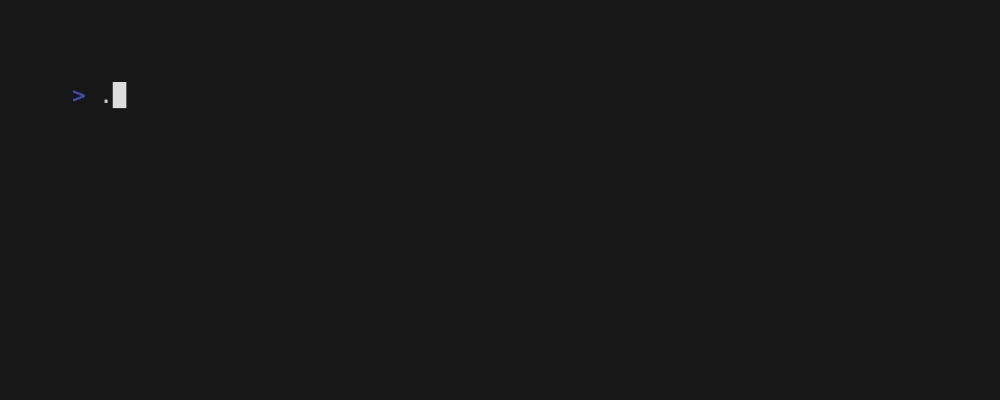

# Notion Database Peek

Library designed to read, and perform small updates to a Notion Database from your terminal, perfect for cloud-based todos.

This library is still under development. Note that it is currently somewhat 'optimized' (read hard-coded) -- installing this script implies you're:

- adding your own extension bearer token to the http headers -- ie defining `NOTION_TOKEN` in your `.env` file

- adjusting some of the query field names to match your own database -- in `query.go`

- building this script yourself with `go generate && go build && go install`.

## Usage

Default usage requires just the database id (long string id in url):

Version and Help text can be viewed by calling the tool with `v` or `h` respectively

## Screenshots

