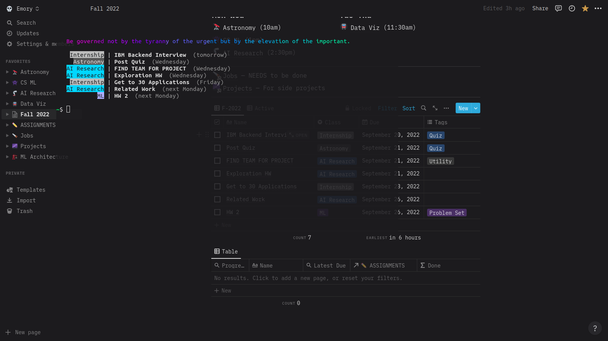

# Notion Database Peek

Library designed to read, and perform small updates to a Notion Database from your terminal, perfect for cloud-based todos. The latest version also includes the ability to specify query field names and pass in the database id and notion token as positional arguments.

## Basic Usage

Default usage requires just the token and database id (long string id in url of notion database). Due to the length of this command, we recommend setting up a bash alias in your bashrc, which will make it easy to type commands for a specific notion database, as shown here:

Version and Help text can be viewed by calling the tool with `v` or `h` respectively

## Getting Started 

The first positional argument is reserved for the Notion Access Token: you will need to create one yourself in order to securely access your Notion content. You can do this by performing the following steps:

1) Navigating to [https://www.notion.so/my-integrations](https://www.notion.so/my-integrations).

2) Clicking on 'New Integration', and filling out the form as you wish (although we do recommend setting the name to NTPeek and using the [official NTPeek Integration logo](https://www.notion.so/image/https%3A%2F%2Fs3-us-west-2.amazonaws.com%2Fpublic.notion-static.com%2F9e0bc46d-c5eb-44d6-b1cb-c3542b4d08c0%2Ftenor.gif?id=170a6e36-bec1-44fa-906e-fe06c92f4e8e&table=bot&userId=d9f1afdc-e094-4675-bbb2-e8b8dd390e8e&cache=v2). Make sure to select the correct 'Associated Workspace'. Notably, the current version needs only read permission.

3) Saving the result 'Internal Integration Token' -- you can pass it as the first positional argument when calling the tool from the command line

You can install Notion Database Peek by downloading the pre-compiled binary from the releases tab in Github and selecting the architecture/os that corresponds to your machine. Remember to add the binary to your path.

## Tailoring to Custom Database 

Do your column names not match the defaults? You might have to pass additional flags as 'templates' for the tool to interact properly with your personal Notion database

### Select

A custom render string can be provided with a select flag, as shown in the example above. This follows a simple markup language syntax, where:

- All elements outside of the `%..%` tags are treated as markup, and will be rendered exactly

- All elements inside the `%..%` tags are treated as field names: they are replaced with data corresponding to the field name within the Notion database, and can also be modified with some type-specific keywords by appending them like so: `:<modifier>`. Note that the render is type-specific. The list of currently supported render types includes: title, rich text, select, multiselect, date, checkbox.

Global modifiers include formatting specifiers, especially `:right`, `:left`, `:center`: for aligning an entire column

Type specific modifiers, currently, include:

- date accepts `:relative`, `:simple`, and `:full` for different representations of date values

#### Special Select Fields

Although the field name specified in a tag usually has to actually exist on your Notion DB, there are some special fields that Notion or the tool provides. These are listed here:

- `%_id%` will render the notion page id for the element

- `%_p%` will render an exclamation point if assigned task priority is high (see the priority flag), and a space otherwise

### Sorting

A sort can be imposed on the data with the sort flag: `--sort="Due,Class:desc`. This pattern is similar to the select flag syntax: you need to pass comma-separate field names to sort by, with an optional `:desc` or `:asc` modifier on each. Note that the sorts are ascending by default

### Filtering

Custom filters can be specified with the filter flag: `--filter="Due:date < NEXT 1 WEEK"`. The syntax is build to accept single conditions (structured as `<name>:<type> <operator> <value>`). These are built to match the Notion filter queries as close as possible.

One can also split these into separate flags, for readability or in alias usage. The tool will re-combine them with 'AND' clauses. This is demonstrated below:

Supported field types occasionally have unique syntax. These field types are listed below, along with some examples of conditions one might want to impose:

1. **Title / Text**: 

   - Check if field is empty with: `Name:text = EMPTY`.

   - Check if text starts/ends with a tag: `Name:text STARTS_WITH "Issue" OR Name:text ENDS_WITH "Issue"`

2. **Checkbox**: check if task is complete with `Done:checkbox = TRUE`.

3. **Multiselect**: check if contains a tag with `Tags:multiselect CONTAINS "Meeting"`

4. **Select**: check for equivalence with `Class:select = "Bio"`

5. **Date**: 

   - Check if falls before specific point: `Due:date <= 2023/01/01`

   - Check if falls between relative dates: `Due:date > LAST 1 WEEK AND Due:date < NEXT 1 MONTH`

6. **Number**: compare against static with `Amount:number < 100`

#### Combining Filter Conditions

Filter conditions can be combined with `AND` and `OR` clauses to arbitrary depth. Note that when using both in a single `--filter` argument, one must use parenthesis to disambiguate between the order of the clauses.

### Priority

Some fields, including text, will be rendered differently based on the priority assigned to the task by the tool: this is a way of differentiating entries that might be more or less important, visually.

The priority assignment is entirely based on tags. The following flags are used to control this process:

- `--priority-field` : string flag specifying the field name in your Notion DB corresponding to a multi-select field  

- `--priority` : comma-separate values of field names to assign 'high priority' to

- `--priority-lo` : comma-separate values of field names to assign 'low priority' to

- `--priority-default` : default priority to assign when no distinguishing tags are present

## Building from Source

This project is built in golang. You can install it yourself, if you have go development tools set up, by running `go install github.com/mfigurski80/NTPeek`.

## Screenshots

